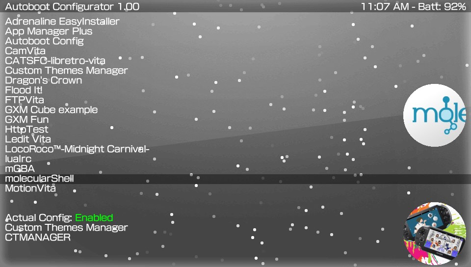

# AutobootConf
Easy Configurator for AutoBoot Plugin.

### Controls ###
- Up/Down: Navigate the application list.
- Cross: Set a selected application as default boot.
- L/R: Disable/Enable the plugin.

### Changelog 1.0 ###
- Initial release.
- Added support to install last version of plugin.
- Added automatic network update. app will now notify you when there's a new update.
- Added suport to enable/disable plugin.
