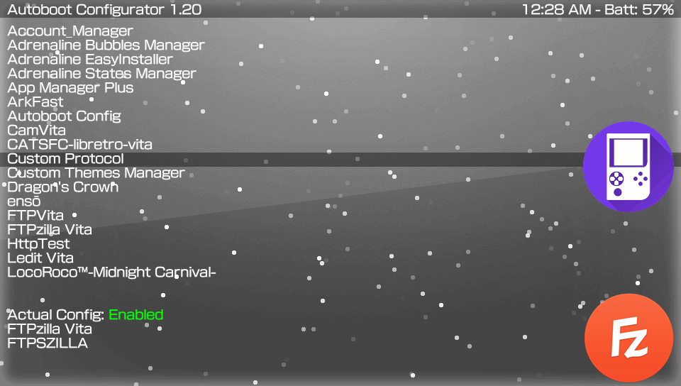

# AutobootConf  

Easy Configurator for AutoBoot Plugin.

### Description ###
This useful application allows you to simply and easily configure the 'AutoBoot' plugin, to select the target to be launched automatically at each start.

### Controls ###
- [up]/[down]: Navigate the application list.
- [cross]: Set a selected application as default boot.
- [l]/[r]: Disable/Enable the plugin.

### Changelog 1.2 ###
- Fix to remove old updater bubble.

### Changelog 1.1 ###
- A little re organized code.
- Updated the 'AutoBoot' to 1.2 version, compatible with enso.

### Changelog 1.0 ###
- Initial release.
- Added support to install last version of plugin.
- Added automatic network update. app will now notify you when there's a new update.
- Added suport to enable/disable plugin.

### Report bugs ###
if you see something wrong, please submit an issue or pull request.

### Credits ###
- The **AutoBoot** plugin is from the coder @rinnegatamante.
- Icon By **WZ-(JK)** in [twitter](https://twitter.com/Mt096Wz.

### Donation ###
In case you want to support my work on the vita, you can always donate for some coffee. Any amount is highly appreciated:

